# Azure Kubernetes 아키텍처 다이어그램

> **ARCHITECTURE.md** 보조 문서 — Mermaid 기반 시각화
> **최종 수정일**: 2026-02-26

---

## 목차

1. [전체 인프라 구성](#1-전체-인프라-구성)
2. [Azure Resource Group 구조](#2-azure-resource-group-구조)
3. [네트워크 토폴로지](#3-네트워크-토폴로지)
4. [트래픽 플로우 — 외부 요청](#4-트래픽-플로우--외부-요청)
5. [트래픽 플로우 — 내부 서비스 간 통신](#5-트래픽-플로우--내부-서비스-간-통신)
6. [관찰성 데이터 흐름](#6-관찰성-데이터-흐름)
7. [시크릿 & 인증 흐름](#7-시크릿--인증-흐름)
8. [GitOps 배포 흐름](#8-gitops-배포-흐름)
9. [백업 & DR 흐름](#9-백업--dr-흐름)
10. [Spot Eviction & 복구 흐름](#10-spot-eviction--복구-흐름)
11. [보안 계층 구조](#11-보안-계층-구조)
12. [설치 워크플로우](#12-설치-워크플로우)

---

## 1. 전체 인프라 구성

> **대상**: 전체 이해관계자 (인프라 엔지니어, 개발자, 매니저)
>
> 3개 AKS 클러스터(mgmt/app1/app2)와 공유 Azure 리소스의 전체 배치를 보여줍니다.
> 핵심 포인트: 모든 클러스터가 공통 리소스(Key Vault, Monitor, Backup Vault)를 **공유**하며,
> 관찰성/백업 데이터는 클러스터 외부에 저장되어 클러스터 독립적으로 보존됩니다.

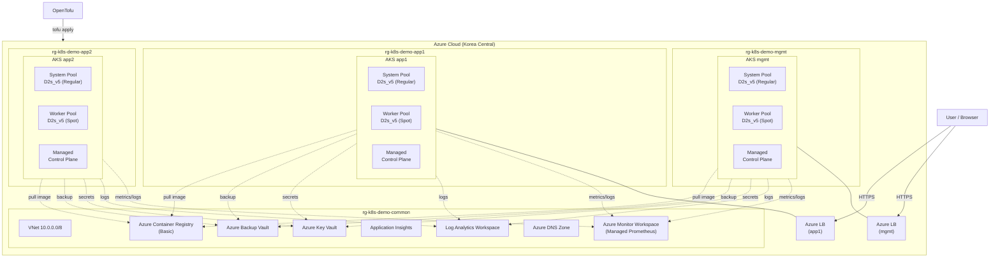

---

## 2. Azure Resource Group 구조

> **대상**: 인프라 엔지니어, 비용 관리자
>
> 4개 Resource Group 간 리소스 소속과 의존 관계를 보여줍니다.
> 핵심 포인트: `rg-k8s-demo-common`에 공유 리소스를 집중하여
> 클러스터별 RG를 독립적으로 생성/삭제할 수 있는 구조입니다.

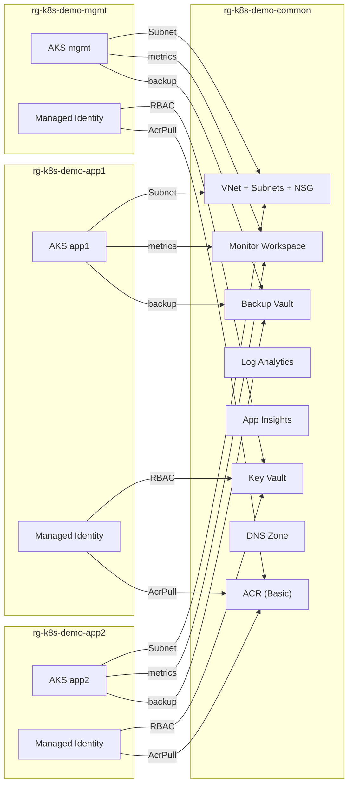

---

## 3. 네트워크 토폴로지

> **대상**: 인프라/네트워크 엔지니어
>
> 단일 VNet 내 3개 서브넷 배치와 Azure CNI Overlay + Managed Cilium 계층을 보여줍니다.
> 핵심 포인트: 같은 VNet 내 서브넷이므로 별도 Peering 없이 통신 가능하며,
> Pod CIDR은 Overlay로 VNet 주소와 분리되어 IP 고갈 걱정이 없습니다.

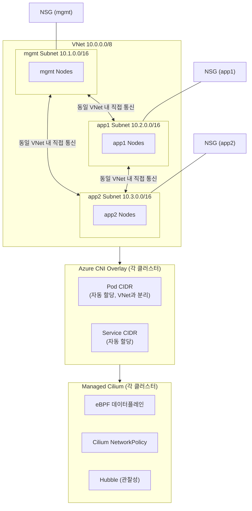

---

## 4. 트래픽 플로우 — 외부 요청

> **대상**: 개발자, 인프라 엔지니어
>
> 외부 사용자 요청이 DNS → Azure LB → Istio Ingress Gateway → VirtualService → Pod까지
> 도달하는 전체 경로를 시퀀스로 보여줍니다.
> 핵심 포인트: TLS Termination은 Istio Gateway에서 수행하며, cert-manager가
> Let's Encrypt 인증서를 자동 갱신합니다. LB는 L4 TCP 포워딩만 담당합니다.

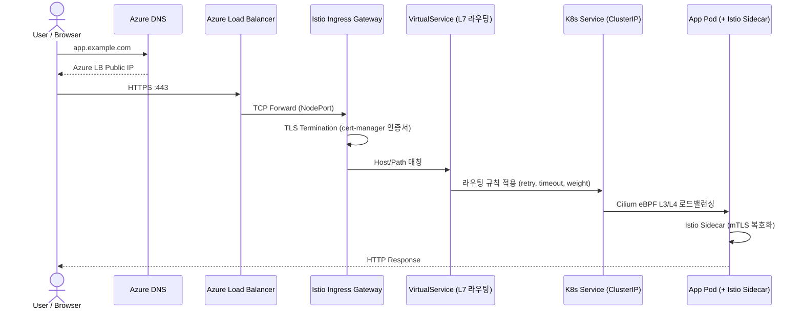

---

## 5. 트래픽 플로우 — 내부 서비스 간 통신

> **대상**: 개발자, 플랫폼 엔지니어
>
> Pod 간 통신에서 Managed Cilium(L3/L4)과 Istio Sidecar(L7)의 역할 분담을 보여줍니다.
> 핵심 포인트: Cilium eBPF가 패킷 라우팅과 NetworkPolicy를 처리하고,
> Envoy Sidecar가 mTLS 암호화와 L7 정책(retry, timeout, AuthorizationPolicy)을 처리합니다.

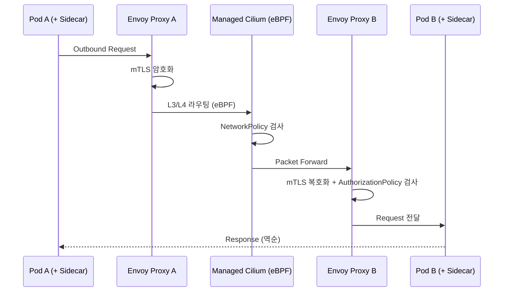

### 계층별 역할 요약

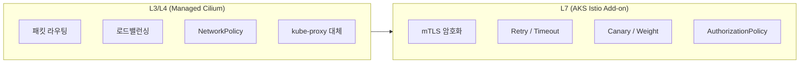

---

## 6. 관찰성 데이터 흐름

> **대상**: SRE, 개발자, 인프라 엔지니어
>
> 메트릭/로그/트레이스 3종 데이터가 클러스터에서 Azure Monitor로 수집되는 경로와
> Azure Portal에서의 시각화 방법을 보여줍니다.
> 핵심 포인트: 모든 관찰성 데이터는 클러스터 외부(Azure Monitor)에 저장되므로
> 클러스터 삭제/장애 시에도 데이터가 보존됩니다.

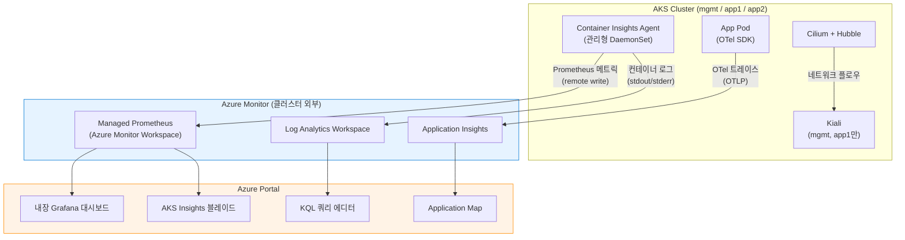

### 데이터 보존 정책

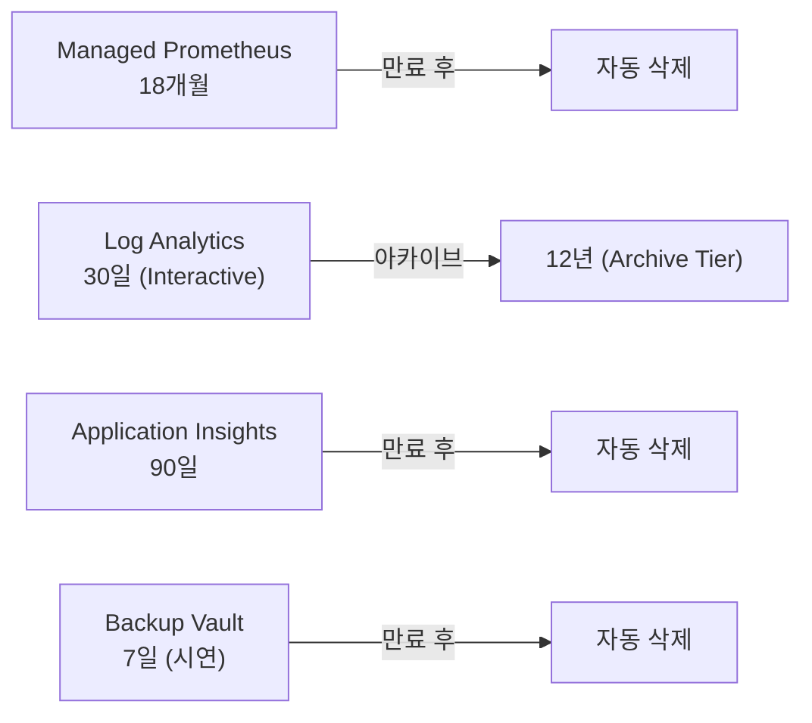

---

## 7. 시크릿 & 인증 흐름

> **대상**: 보안 엔지니어, 개발자
>
> Pod 시작 시 Key Vault CSI Driver를 통한 시크릿 마운트 과정과
> Workload Identity의 Token Exchange 메커니즘을 보여줍니다.
> 핵심 포인트: 시크릿은 etcd에 저장되지 않고 Volume Mount로 직접 주입되며,
> 2분 간격 Auto-rotation으로 Key Vault 변경사항이 자동 반영됩니다.

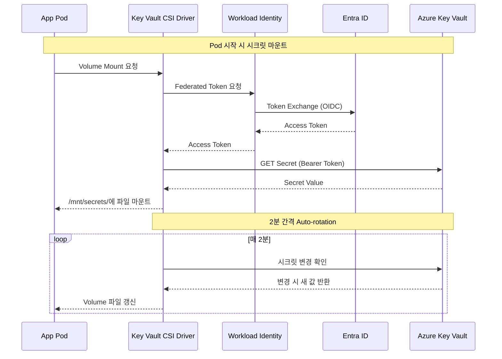

### Workload Identity 연동 맵

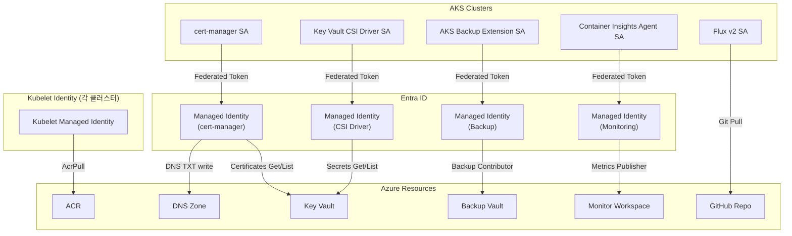

---

## 8. GitOps 배포 흐름

> **대상**: 개발자, DevOps 엔지니어
>
> Developer → GitHub → Flux v2 → Kubernetes 배포 파이프라인과
> 클러스터별 독립 Flux 인스턴스의 멀티클러스터 구조를 보여줍니다.
> 핵심 포인트: 각 클러스터에 독립된 Flux가 동작하며, Repository의 `base/`에서
> 공통 manifest를 상속하고 `clusters/<name>/`에서 클러스터별 오버라이드를 적용합니다.

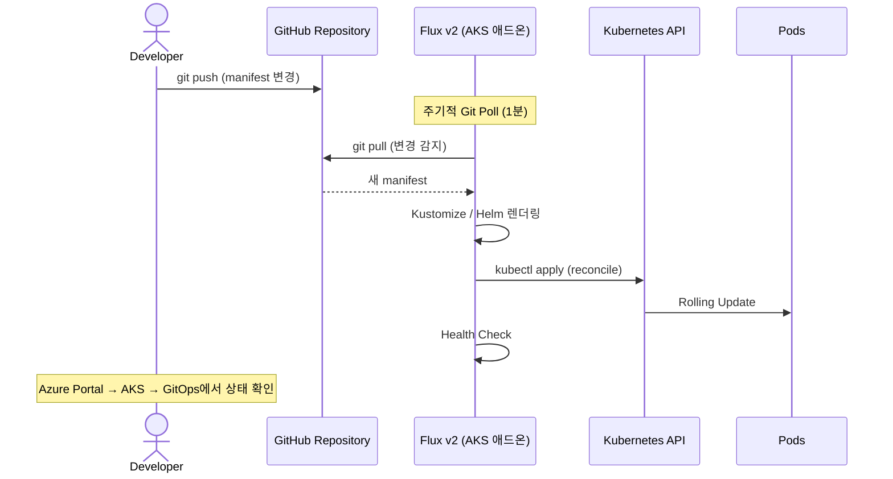

### GitOps 멀티클러스터 구조

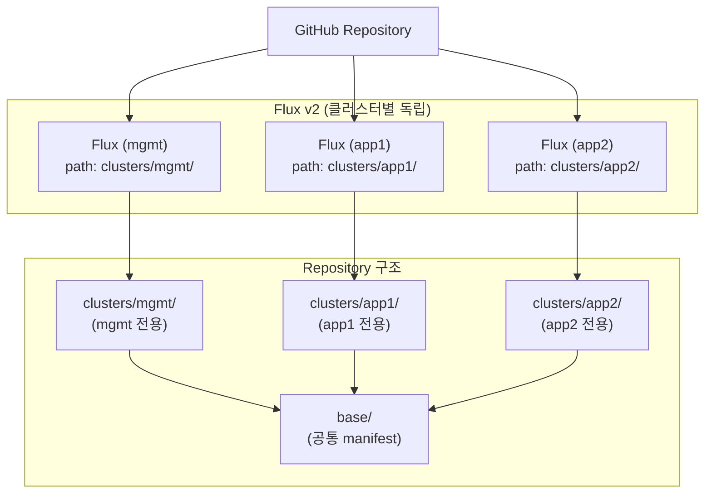

---

## 9. 백업 & DR 흐름

> **대상**: 인프라 엔지니어, SRE
>
> Azure Backup Vault를 통한 일일 스냅샷 정책과 3가지 복원 시나리오를 보여줍니다.
> 핵심 포인트: Spot Eviction은 Karpenter가 자동 복구(~5분)하고,
> 클러스터 장애 시 `tofu apply` + Backup 복원으로 ~30분 내 복구 가능합니다.

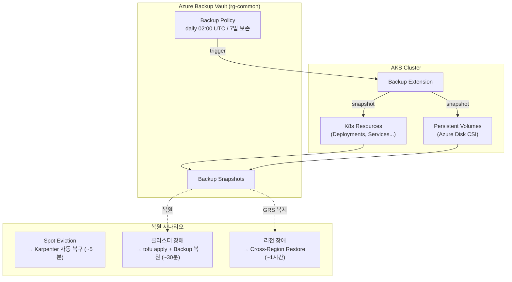

---

## 10. Spot Eviction & 복구 흐름

> **대상**: 인프라 엔지니어, SRE
>
> Spot VM 퇴거 발생 시 Karpenter(NAP)의 자동 복구 시퀀스를 보여줍니다.
> 핵심 포인트: Spot 용량 부족 시 On-Demand로 자동 Fallback하며,
> PodDisruptionBudget과 TopologySpreadConstraints로 동시 퇴거 영향을 최소화합니다.

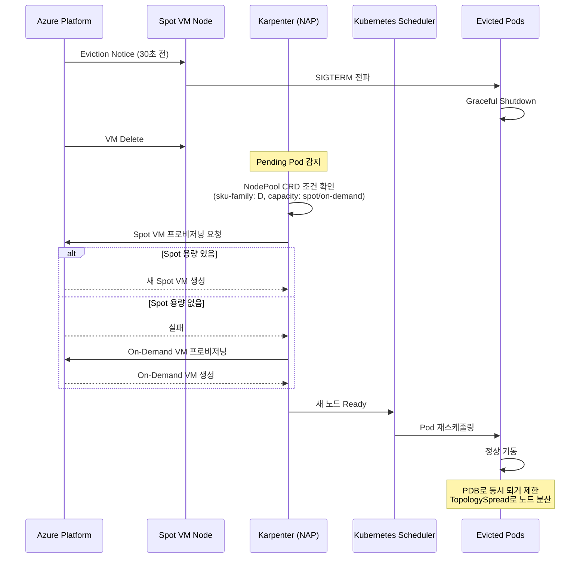

---

## 11. 보안 계층 구조

> **대상**: 보안 엔지니어, 아키텍트
>
> ID/접근제어 → 워크로드 정책 → 네트워크 → 시크릿 → 런타임 → 취약점 관리의
> 6계층 보안 모델(Defense in Depth)을 보여줍니다.
> 핵심 포인트: 각 계층은 독립적으로 동작하여 한 계층이 뚫려도
> 다음 계층에서 차단하는 다중 방어 구조입니다.

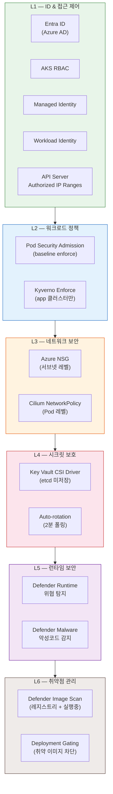

---

## 12. 설치 워크플로우

> **대상**: 인프라 엔지니어
>
> Phase 1(`tofu apply`, 15~20분)과 Phase 2(`addons/install.sh`, 10~15분)의
> 2단계 설치 과정과 리소스 간 의존 관계를 보여줍니다.
> 핵심 포인트: Phase 1에서 인프라와 AKS 클러스터를 생성하면
> Managed Cilium/Prometheus/Karpenter 등이 자동 활성화되고,
> Phase 2에서 Istio/Flux/Kyverno 등 애드온을 순차 설치합니다.

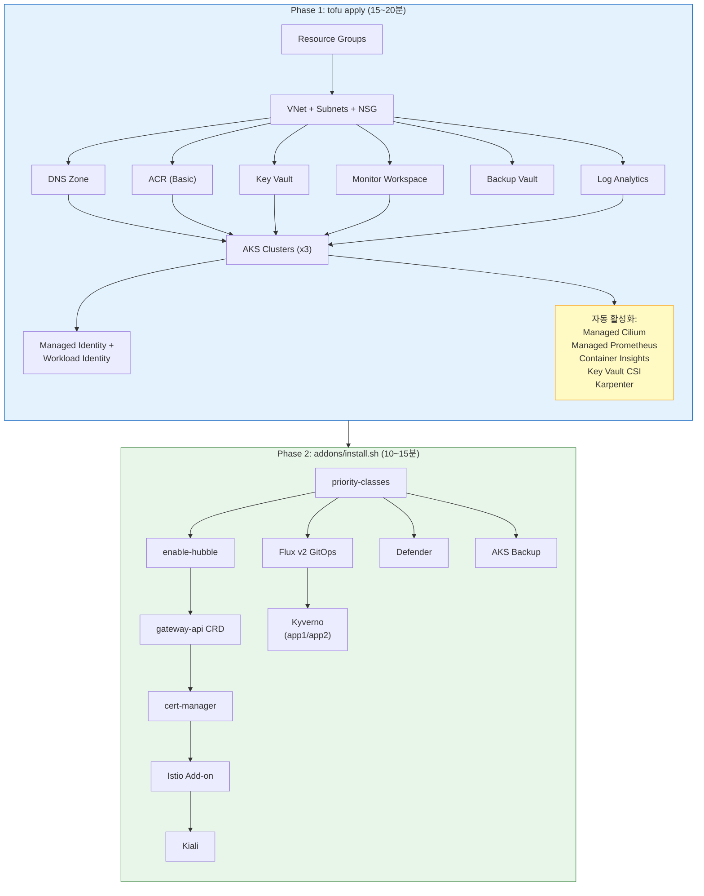
