# Azure Kubernetes 아키텍처 다이어그램

> **ARCHITECTURE.md** 보조 문서 — Mermaid 기반 시각화
> **최종 수정일**: 2026-02-27

---

## 목차

1. [전체 인프라 구성](#1-전체-인프라-구성)
2. [Azure Resource Group 구조](#2-azure-resource-group-구조)
3. [네트워크 토폴로지](#3-네트워크-토폴로지)
4. [트래픽 플로우](#4-트래픽-플로우)
5. [보안 계층 구조](#5-보안-계층-구조)
6. [시크릿 & 인증 흐름](#6-시크릿--인증-흐름)
7. [관찰성 데이터 흐름](#7-관찰성-데이터-흐름)
8. [GitOps 배포 흐름](#8-gitops-배포-흐름)
9. [Spot Eviction & 복구 흐름](#9-spot-eviction--복구-흐름)
10. [백업 & DR 흐름](#10-백업--dr-흐름)
11. [설치 워크플로우](#11-설치-워크플로우)
12. [Korea Central AZ 아키텍처](#12-korea-central-availability-zone-아키텍처)
13. [관리자 접근 흐름 (Bastion)](#13-관리자-접근-흐름-bastion)

---

## 1. 전체 인프라 구성

> **대상**: 전체 이해관계자 (인프라 엔지니어, 개발자, 매니저)
>
> 3개 AKS 클러스터(mgmt/app1/app2)와 공유 Azure 리소스의 전체 배치를 보여줍니다.
> 핵심 포인트: 모든 클러스터가 공통 리소스(Key Vault, Monitor, Backup Vault)를 **공유**하며,
> 관찰성/백업 데이터는 클러스터 외부에 저장되어 클러스터 독립적으로 보존됩니다.

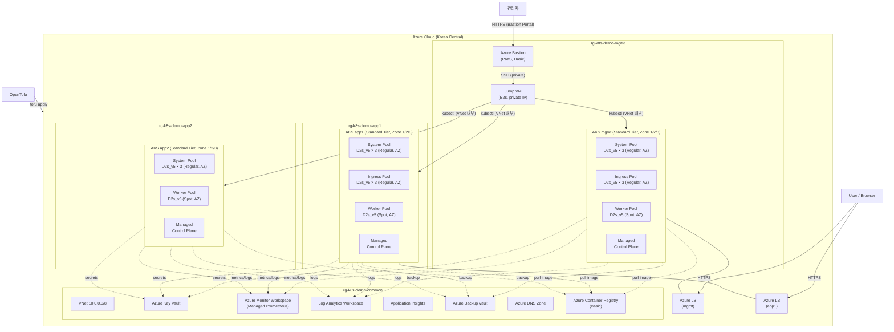

---

## 2. Azure Resource Group 구조

> **대상**: 인프라 엔지니어, 비용 관리자
>
> 4개 Resource Group 간 리소스 소속과 의존 관계를 보여줍니다.
> 핵심 포인트: `rg-k8s-demo-common`에 공유 리소스를 집중하여
> 클러스터별 RG를 독립적으로 생성/삭제할 수 있는 구조입니다.

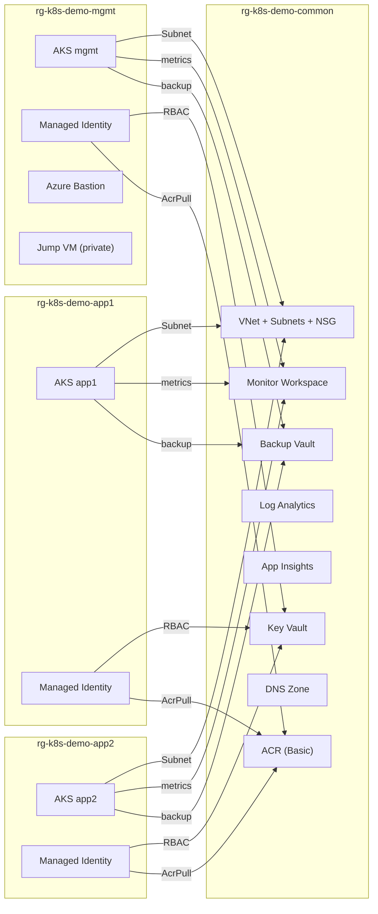

---

## 3. 네트워크 토폴로지

> **대상**: 인프라/네트워크 엔지니어
>
> 클러스터별 독립 VNet과 VNet Peering, Azure CNI Overlay + Managed Cilium 계층을 보여줍니다.
> 핵심 포인트: 각 클러스터는 **별도 VNet**(10.1~10.3.0.0/16)을 가지며
> **VNet Peering**으로 상호 연결됩니다. Pod CIDR은 Overlay로 VNet 주소와 분리됩니다.

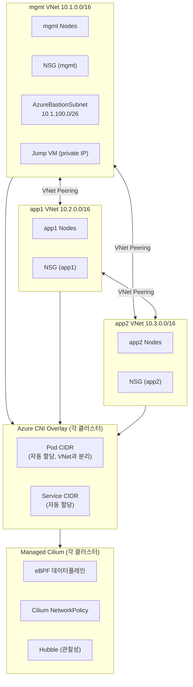

---

## 4. 트래픽 플로우

### 4.1 외부 요청 흐름

> **대상**: 개발자, 인프라 엔지니어
>
> 외부 사용자 요청이 DNS → Azure LB → Istio Ingress Gateway → VirtualService → Pod까지
> 도달하는 전체 경로를 시퀀스로 보여줍니다.
> 핵심 포인트: TLS Termination은 Istio Gateway에서 수행하며, cert-manager가
> Let's Encrypt 인증서를 자동 갱신합니다. LB는 L4 TCP 포워딩만 담당합니다.

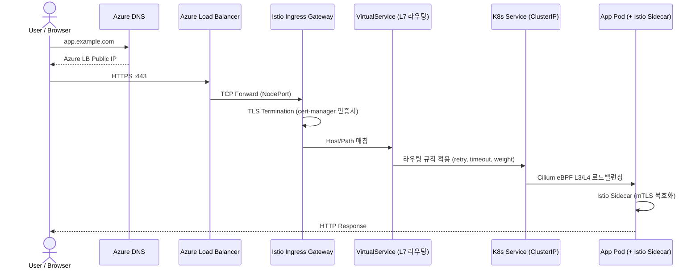

### 4.2 내부 서비스 간 통신

> **대상**: 개발자, 플랫폼 엔지니어
>
> Pod 간 통신에서 Managed Cilium(L3/L4)과 Istio Sidecar(L7)의 역할 분담을 보여줍니다.
> 핵심 포인트: Cilium eBPF가 패킷 라우팅과 NetworkPolicy를 처리하고,
> Envoy Sidecar가 mTLS 암호화와 L7 정책(retry, timeout, AuthorizationPolicy)을 처리합니다.

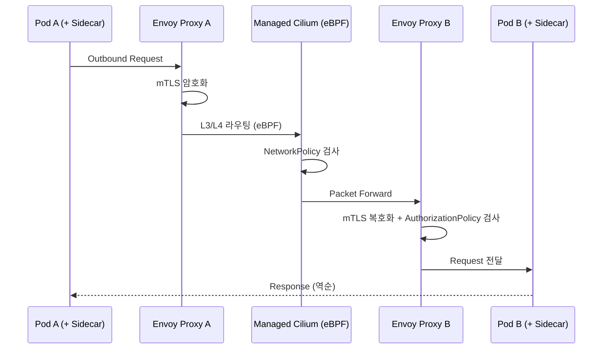

### 계층별 역할 요약

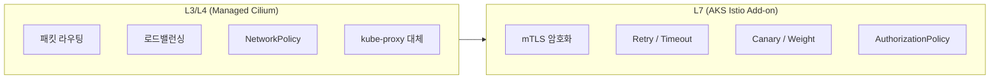

---

## 5. 보안 계층 구조

> **대상**: 보안 엔지니어, 아키텍트
>
> ID/접근제어 → 워크로드 정책 → 네트워크 → 시크릿 → 런타임 → 취약점 관리의
> 6계층 보안 모델(Defense in Depth)을 보여줍니다.
> 핵심 포인트: 각 계층은 독립적으로 동작하여 한 계층이 뚫려도
> 다음 계층에서 차단하는 다중 방어 구조입니다.

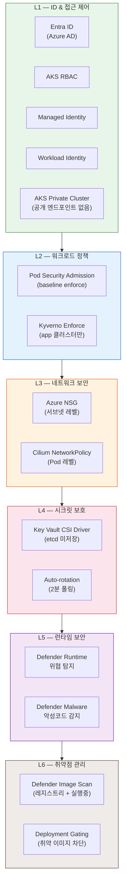

---

## 6. 시크릿 & 인증 흐름

> **대상**: 보안 엔지니어, 개발자
>
> TLS 인증서 발급(cert-manager) → Key Vault 동기화(ESO PushSecret) → Pod 마운트(CSI Driver) → 자동 재시작(Stakater Reloader)의
> 완전 자동화 라이프사이클과 일반 시크릿 마운트 흐름을 보여줍니다.
> 핵심 포인트: Private Key가 etcd에 장기 보관되지 않고 Key Vault에만 저장되며,
> 인증서 갱신 시 수동 개입 없이 Pod가 자동으로 재시작됩니다.

### TLS 인증서 자동 갱신 라이프사이클

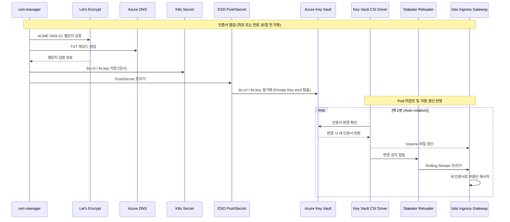

### 일반 시크릿 마운트 흐름 (앱 워크로드)

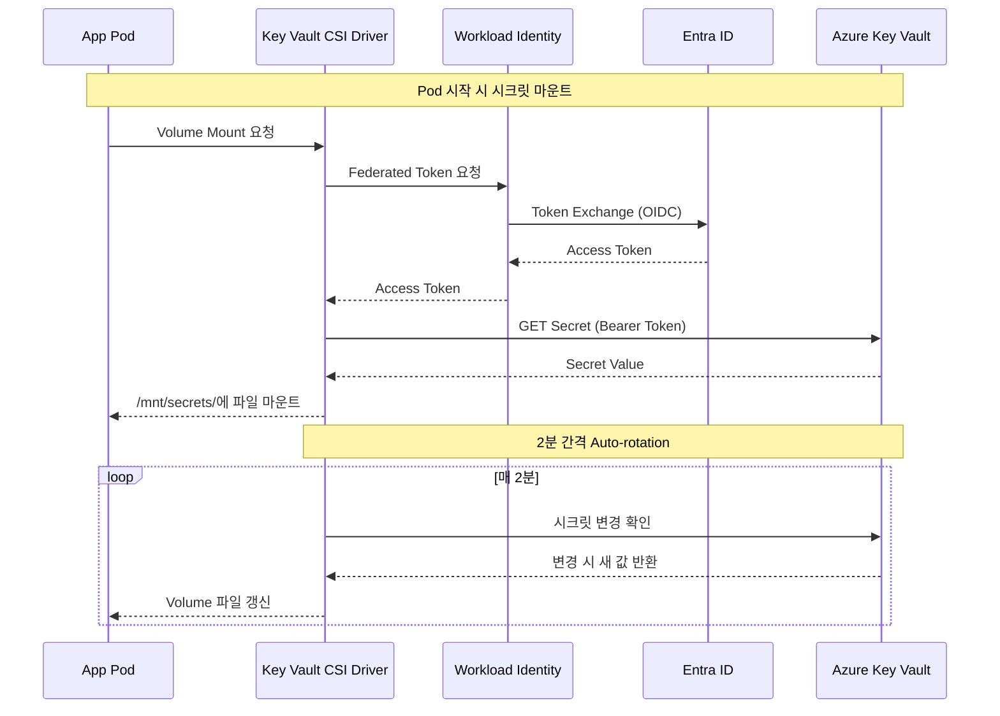

### Workload Identity 연동 맵

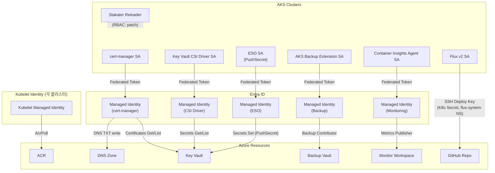

---

## 7. 관찰성 데이터 흐름

> **대상**: SRE, 개발자, 인프라 엔지니어
>
> 메트릭/로그/트레이스 3종 데이터가 클러스터에서 Azure Monitor로 수집되는 경로와
> Azure Portal에서의 시각화 방법을 보여줍니다.
> 핵심 포인트: 모든 관찰성 데이터는 클러스터 외부(Azure Monitor)에 저장되므로
> 클러스터 삭제/장애 시에도 데이터가 보존됩니다.

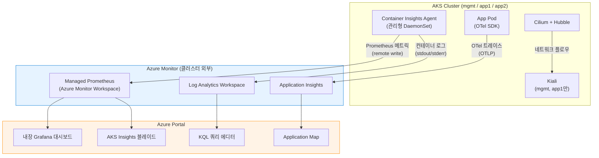

### 데이터 보존 정책

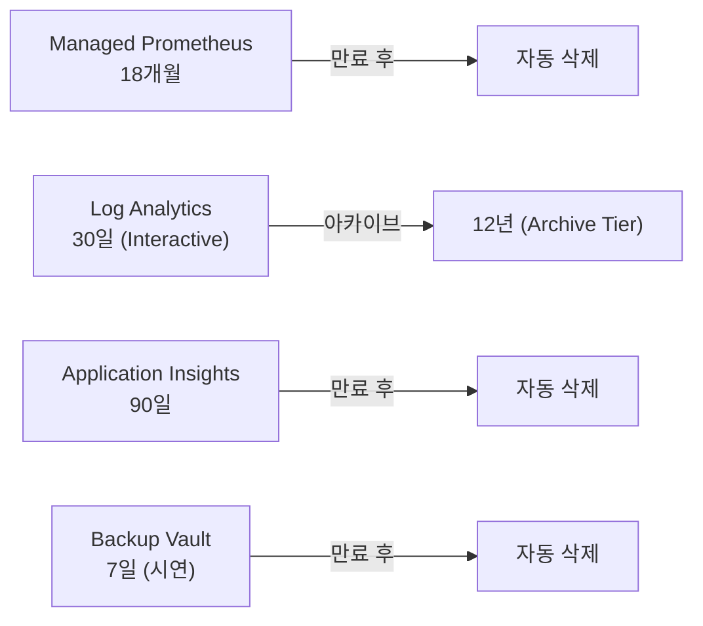

---

## 8. GitOps 배포 흐름

> **대상**: 개발자, DevOps 엔지니어
>
> Developer → GitHub → Flux v2 → Kubernetes 배포 파이프라인과
> 클러스터별 독립 Flux 인스턴스의 멀티클러스터 구조를 보여줍니다.
> 핵심 포인트: 각 클러스터에 독립된 Flux가 동작하며, Repository의 `base/`에서
> 공통 manifest를 상속하고 `clusters/<name>/`에서 클러스터별 오버라이드를 적용합니다.

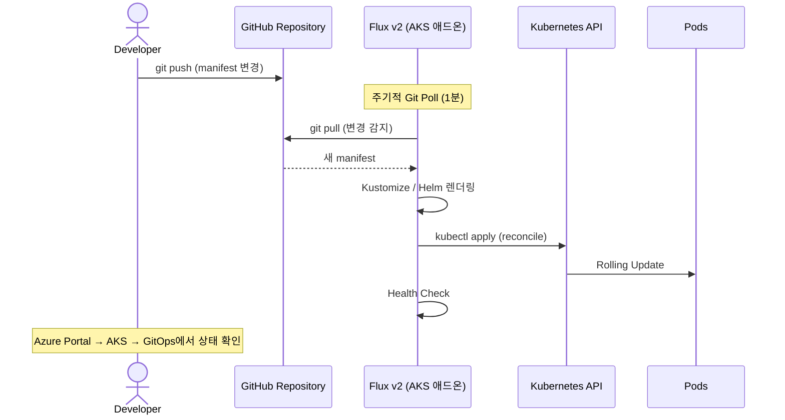

### GitOps 멀티클러스터 구조

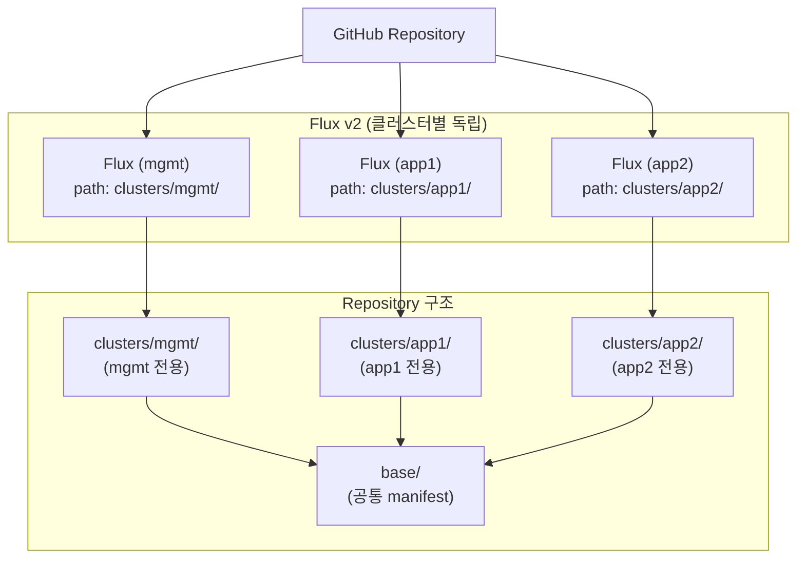

---

## 9. Spot Eviction & 복구 흐름

> **대상**: 인프라 엔지니어, SRE
>
> Spot VM 퇴거 발생 시 Karpenter(NAP)의 자동 복구 시퀀스를 보여줍니다.
> 핵심 포인트: On-Demand 폴백 미사용 — Spot 용량 부족 Zone에서 다른 Zone으로만 폴백하며,
> PodDisruptionBudget과 TopologySpreadConstraints로 동시 퇴거 영향을 최소화합니다.
> 3개 Zone 모두 Spot 용량 없으면 워크로드 Pending 유지 (의식적 트레이드오프).

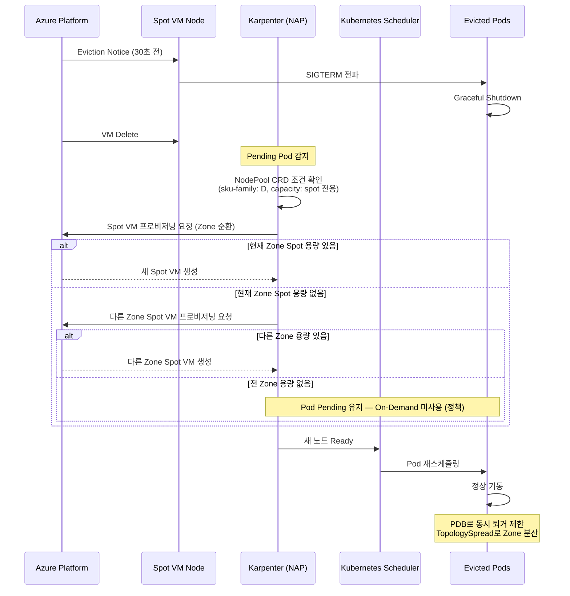

---

## 10. 백업 & DR 흐름

> **대상**: 인프라 엔지니어, SRE
>
> Azure Backup Vault를 통한 일일 스냅샷 정책과 3가지 복원 시나리오를 보여줍니다.
> 핵심 포인트: Spot Eviction은 Karpenter가 자동 복구(~5분)하고,
> 클러스터 장애 시 `tofu apply` + Backup 복원으로 ~30분 내 복구 가능합니다.

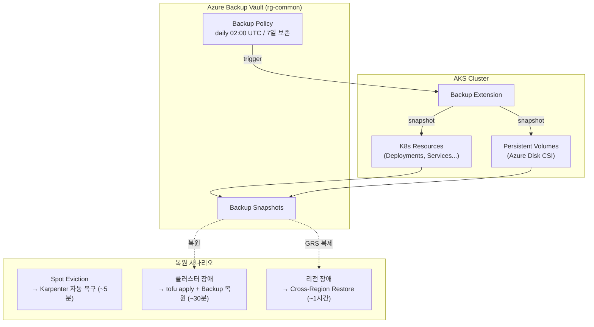

---

## 11. 설치 워크플로우

> **대상**: 인프라 엔지니어
>
> Phase 1(`tofu apply`, 20~30분)과 Phase 2(`addons/install.sh`, 10~15분)의
> 2단계 설치 과정과 리소스 간 의존 관계를 보여줍니다.
> 핵심 포인트: Phase 1에서 인프라와 AKS 클러스터를 생성하면
> Managed Cilium/Prometheus/Karpenter 등이 자동 활성화되고,
> Phase 2에서 Istio/Flux/Kyverno 등 애드온을 순차 설치합니다.

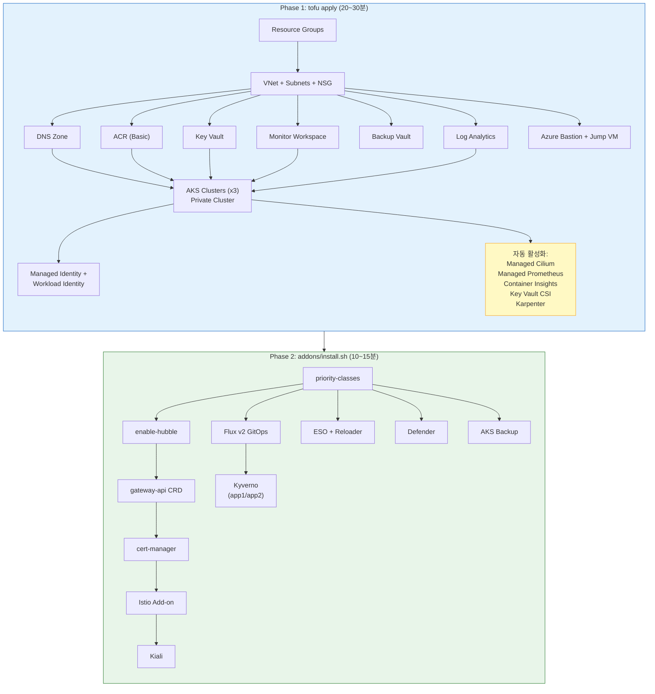

---

## 12. Korea Central Availability Zone 아키텍처

> **대상**: 인프라 엔지니어, 아키텍트
>
> Korea Central(서울) Zone 1/2/3에 걸친 노드풀 분산 배치와
> Zone 장애 시 서비스 지속 구조를 보여줍니다.
> 핵심 포인트: System + Ingress 노드를 Regular VM으로 3 Zone 분산하여
> 단일 Zone 장애 시에도 Control Plane, Ingress Gateway, 앱 워크로드가 지속됩니다.

```mermaid
graph TB
    subgraph KC["Korea Central (서울)"]

        subgraph Z1["Availability Zone 1"]
            direction TB
            subgraph M1["mgmt"]
                MS1["system (Regular)"]
                MI1["ingress (Regular)"]
                MW1["worker (Spot)"]
            end
            subgraph A1Z1["app1"]
                A1S1["system (Regular)"]
                A1I1["ingress (Regular)"]
                A1W1["worker (Spot)"]
            end
            subgraph A2Z1["app2"]
                A2S1["system (Regular)"]
                A2W1["worker (Spot)"]
            end
        end

        subgraph Z2["Availability Zone 2"]
            direction TB
            subgraph M2["mgmt"]
                MS2["system (Regular)"]
                MI2["ingress (Regular)"]
                MW2["worker (Spot)"]
            end
            subgraph A1Z2["app1"]
                A1S2["system (Regular)"]
                A1I2["ingress (Regular)"]
                A1W2["worker (Spot)"]
            end
            subgraph A2Z2["app2"]
                A2S2["system (Regular)"]
                A2W2["worker (Spot)"]
            end
        end

        subgraph Z3["Availability Zone 3"]
            direction TB
            subgraph M3["mgmt"]
                MS3["system (Regular)"]
                MI3["ingress (Regular)"]
                MW3["worker (Spot)"]
            end
            subgraph A1Z3["app1"]
                A1S3["system (Regular)"]
                A1I3["ingress (Regular)"]
                A1W3["worker (Spot)"]
            end
            subgraph A2Z3["app2"]
                A2S3["system (Regular)"]
                A2W3["worker (Spot)"]
            end
        end
    end

    ALB_M["Azure LB mgmt<br/>(Zone-redundant)"]
    ALB_A1["Azure LB app1<br/>(Zone-redundant)"]

    MI1 & MI2 & MI3 --> ALB_M
    A1I1 & A1I2 & A1I3 --> ALB_A1
    %% app2: Ingress/Istio 미배포 — 외부 LB 없음

    User["User / Browser"]
    User --> ALB_M & ALB_A1

    style Z1 fill:#e3f2fd,stroke:#1565c0
    style Z2 fill:#e8f5e9,stroke:#2e7d32
    style Z3 fill:#fff3e0,stroke:#e65100
```

### Zone 장애 시나리오

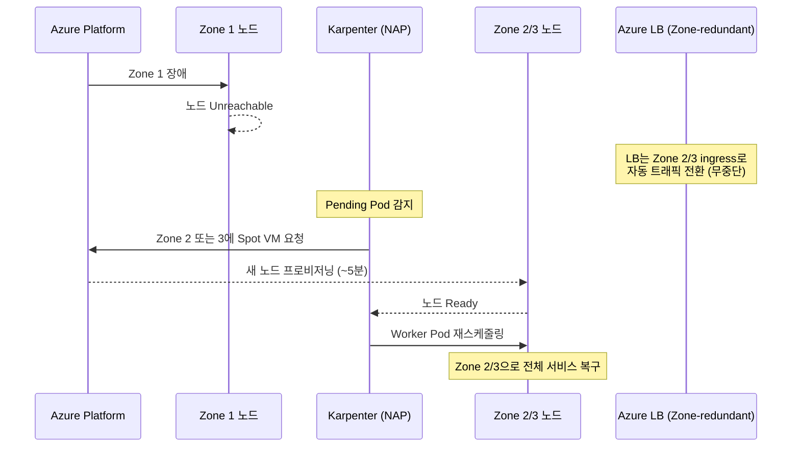

### Korea Central AZ 서비스 지원 현황

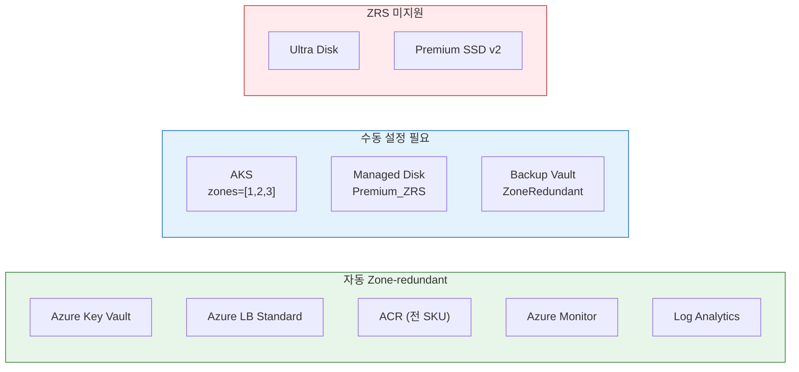

---

## 13. 관리자 접근 흐름 (Bastion)

> **대상**: 인프라 엔지니어, 보안 엔지니어
>
> 관리자가 AKS 클러스터에 kubectl로 접근하는 유일한 경로를 보여줍니다.
> 핵심 포인트: Jump VM에 Public IP가 없고 Azure Bastion만이 외부 진입점입니다.
> AKS Private Cluster로 공개 엔드포인트가 없어 외부에서 직접 kubectl 실행이 불가합니다.

```mermaid
sequenceDiagram
    actor Admin as 관리자
    participant BPUB as Azure Bastion<br/>(Public IP)
    participant BJMP as Jump VM<br/>(vm-jumpbox, private)
    participant AAD as Entra ID
    participant AKS as AKS API Server<br/>(Private Cluster — VNet 내부 DNS)

    Note over Admin,AKS: 관리자 접근 — Bastion 경유 필수
    Admin->>BPUB: HTTPS :443 (Azure Portal → Bastion Connect)
    BPUB->>AAD: Entra ID 인증
    AAD-->>Admin: MFA 완료
    BPUB->>BJMP: SSH (브라우저 터미널, VNet 내부)
    Note over BJMP: Jump VM 내부에서 작업
    BJMP->>AAD: az login (Managed Identity 또는 CLI)
    AAD-->>BJMP: Access Token
    BJMP->>AKS: az aks get-credentials
    AKS-->>BJMP: kubeconfig 취득
    BJMP->>AKS: kubectl 명령 (VNet 내부 통신)
    AKS-->>BJMP: 응답
    Note over Admin,AKS: Jump VM 외부에서 직접 kubectl 시도 시 — 차단 (Private Cluster, 외부 접근 불가)
```

### 접근 경로 비교

```mermaid
graph LR
    subgraph Blocked["❌ 차단 경로"]
        EXT["외부 PC"] -->|"kubectl (직접)"| AKSAPI["AKS API Server<br/>(Private Cluster — 공개 엔드포인트 없음)"]
    end

    subgraph Allowed["✅ 허용 경로"]
        ADMIN["관리자"] -->|"HTTPS"| BAST["Azure Bastion<br/>(Public IP)"]
        BAST -->|"SSH (private)"| JUMP["Jump VM<br/>(private IP)"]
        JUMP -->|"kubectl<br/>(VNet 내부)"| AKSAPI2["AKS API Server<br/>(Private Cluster)"]
    end

    style Blocked fill:#ffebee,stroke:#c62828
    style Allowed fill:#e8f5e9,stroke:#2e7d32
```
